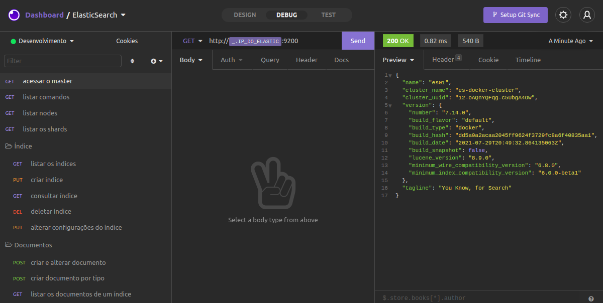

# Laboratório Elastic Stack
Configura e sobe:
  - 3 nós Elasticsearch, 
  - Kibana, 
  - Logstash, 
  - Metricbeat, 
  - Auditbeat (Auditoria), 
  - Filebeat, 
  - Cérebro (Ferramenta de monitoramento e gestão alternativa ao Kibana)
  - Segurança pré-configurada.

### Requisitos
- [Docker Compose](https://docs.docker.com/compose/install/)
- Set vm.max_map_count to at least 262144:
  - ` sudo sysctl -w vm.max_map_count=262144 `

### Rode docker-compose para subir o Cluster:
- ` docker-compose up `

### Urls
- master: http://localhost:9200/
- kibana: http://localhost:5601/

### Consultas configuradas no Insomnia
- Instalar o [Insomnia](https://insomnia.rest/download).
- importar o arquivo [Insomnia_elastic.yaml](assets/Insomnia_elastic.yaml).


### Extensões recomendadas:
- Chrome:
  - https://chrome.google.com/webstore/detail/elasticsearch-head/ffmkiejjmecolpfloofpjologoblkegm/related?hl=pt-BR

- Visual Studio:
  - [Docker](https://marketplace.visualstudio.com/items?itemName=ms-azuretools.vscode-docker)
  - [Elasticsearch for VSCode](https://marketplace.visualstudio.com/items?itemName=ria.elastic)

### Documentação
- Query Strings:
  - https://www.elastic.co/guide/en/elasticsearch/reference/current/query-dsl-query-string-query.html?baymax=rec&rogue=pop-1&elektra=guide

- Documentação de referência:
  - https://www.elastic.co/guide/en/elasticsearch/reference/current/docker.html
  - https://www.elastic.co/guide/en/elastic-stack-get-started/current/get-started-docker.html


### Ativar e usar senhas
- Descomente a linha que ativa a requisição de senha dentros dos nós:
  - xpack.security.enabled=true
- Execute o comando dentro dentro do es01
  - ``` ./bin/elasticsearch-setup-passwords auto ```  ou ``` ./bin/elasticsearch-setup-passwords interactive ```
- Copie as senhas e as altere no docker-compose.yml
- Colocar a senha no output do logstash.conf.

### Ativar navegação por HTTPS (Auto Autenticado)
- Execute o comando dentro do es01 
``` 
    ./bin/elasticsearch-certutil http 


    Generate a CSR? n
    Use an existing CA? y
    CA Path: /usr/share/elasticsearch/config/elastic-stack-ca.p12
    For how long should your certificate be valid?
    Generate a certificate per node? y
    node #1 name: es01
    Enter all the hostnames that you need, one per line. es01
    Enter all the IP addresses that you need, one per line. 10.104.0.4
    Generate additional certificates? y
    node #2 name: es02
    Enter all the hostnames that you need, one per line. es02
    Enter all the IP addresses that you need, one per line. 10.104.0.2
    Generate additional certificates? y
    node #2 name: es03
    Enter all the hostnames that you need, one per line. es03
    Enter all the IP addresses that you need, one per line. 10.104.0.5
    Generate additional certificates? n
```
- Copie a pasta zipada para a pasta security localmente
  - ``` docker cp es01://usr/share/elasticsearch/elasticsearch-ssl-http.zip ./security```

- Descompacte o arquivo zipado na pasta security

- Descomente as linhas nos nós
   - xpack.security.http.ssl.enabled=true
   - xpack.security.http.ssl.keystore.path=http.p12

- Mude as urls dos nós de http para https no docker-compose.yml  
- Comentar a linha SSL_VERIFICATION_MODE em kib01 no docker-compose.yml 
- Colocar https no output do logstash.conf.